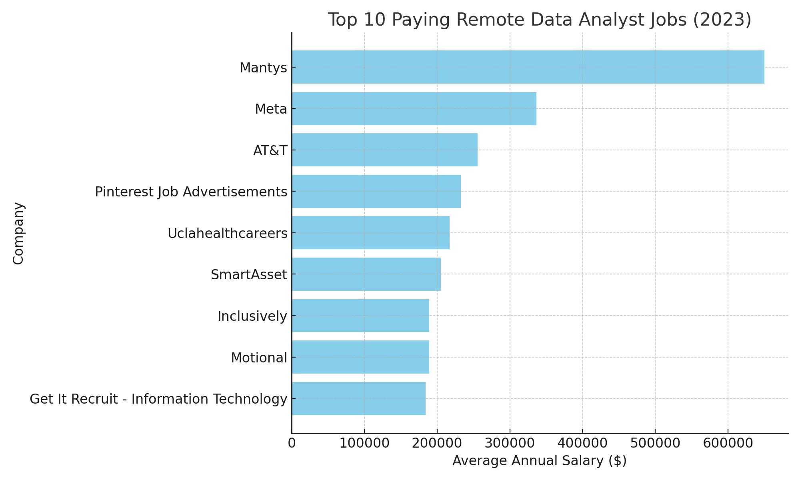
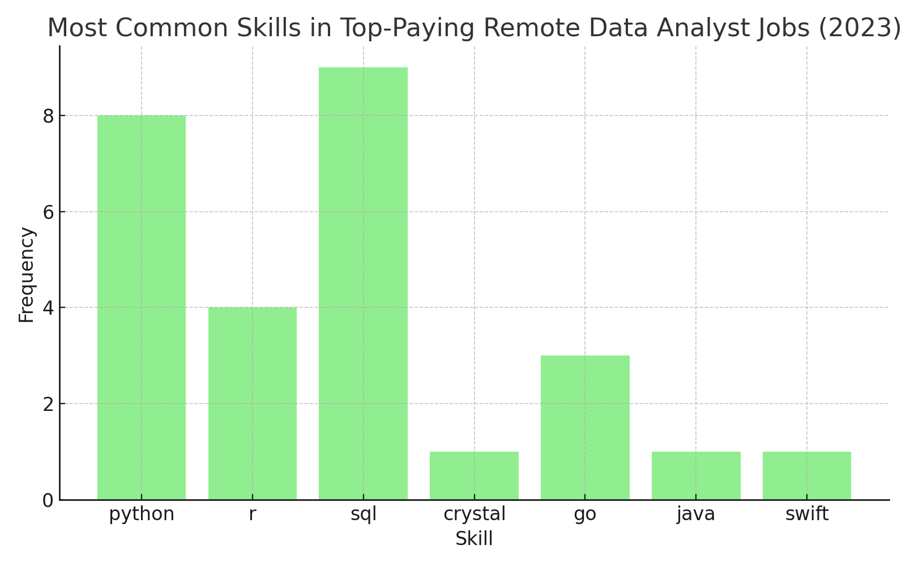

# Introduction

Jump into the world of data analytics careers! This project takes a deep look into roles for data analysts—highlighting the most lucrative positions 💰, the most sought-after skills 🔥, and ✅ where high-paying jobs align with high-demand expertise.

👉 SQL queries used? Browse the scripts here: [project_sql folder](/project_sql/)

# Background

This project emerged from a need to better understand the data analyst job landscape. The goal was to identify which roles are best paid and which skills are currently trending, making it easier for others to navigate their job search with data-backed insights.

The dataset used comes from my [SQL Course](https://lukebarousse.com/sql), which offers in-depth information on job roles, compensation, required skills, and geographical trends.

### The questions I wanted to answer through my SQL queries were:

1. What are the top-paying data analyst jobs?
2. What skills are required for these top-paying jobs?
3. What skills are most in demand for data analysts?
4. Which skills are associated with higher salaries?
5. What are the most optimal skills to learn?

# Tools I Used
To explore and analyze trends in the data analytics job market, I relied on a few essential tools that made my work efficient and insightful:

- **SQL:** The foundation of my analysis—helping me extract, filter, and manipulate data to uncover valuable insights.
- **PostgreSQL:** My preferred database management system, perfect for storing and handling large volumes of job market data.
- **Visual Studio Code:** My primary environment for writing and executing SQL queries with ease and flexibility.
- **Git & GitHub:** Crucial for version control and collaboration, allowing me to manage my scripts, track progress, and share results effectively.

# What I Learned

During this journey, I've significantly boosted my SQL skills with powerful techniques:

- **💡 Advanced Query Building:** Mastered the craft of writing sophisticated SQL queries, expertly combining tables and using WITH clauses for complex temporary table operations.

- **📊 Data Aggregation:** Got comfortable using GROUP BY and aggregate functions like COUNT() and AVG() to turn raw data into meaningful summaries.

- **🧙‍♂️ Data Analysis Wizardry:** Sharpened my problem-solving skills by transforming challenging questions into smart, actionable SQL solutions.

# The Analysis

Each query in this project aimed at investigating specific aspects of the data analyst job market. Here's how I approached each question:

### 1. Top Paying Data Analyst Jobs
To identify the highest paying roles, I filtered data analyst positions by average yearly salary and location, focusing on remote jobs. This query highlights the high paying opportunities in the field.

```sql
SELECT 
job_id,
job_title,
job_location,
job_schedule_type,
salary_year_avg,
job_posted_date,
name AS company_name

FROM 
job_postings_fact jpf

LEFT JOIN company_dim cd ON jpf.company_id = cd company_id

WHERE 
job_title_short = 'Data Analyst' AND 
job_location = 'Anywhere' AND 
salary_year_avg IS NOT NULL

ORDER BY salary_year_avg DESC

LIMIT 10;
```


*Bar graph visualizing the salary for the top 10 salaries for data analysts, ChatGPT generated this graph from my SQL query results*

Here's the breakdown of the top data analyst jobs in 2023:

- **Salary Highlights:** Mantys offered the highest-paying remote Data Analyst job in 2023 ($650K), followed by Meta ($336K) and AT&T ($255K).
- **Job Structure:** All top 10 positions were full-time and remote, with salaries mostly above $180K, showing strong compensation for experienced analysts.
- **Industry Spread:** The companies span various sectors (tech, telecom, healthcare), indicating wide demand for data analytics expertise.

### 2. Skills For Top Paying Data Analyst Jobs
To uncover the key skills driving higher compensation, I analyzed the skill requirements for the top 10 highest-paying remote data analyst roles. This query identifies which technical abilities are most valued by employers offering premium salaries.

```sql
WITH top_paying_jobs AS (
    SELECT 
        job_id,
        job_title,
        salary_year_avg,
        name AS company_name
    FROM job_postings_fact
    LEFT JOIN company_dim 
        ON job_postings_fact.company_id = company_dim.company_id
    WHERE 
        job_title_short = 'Data Analyst' 
        AND job_location = 'Anywhere' 
        AND salary_year_avg IS NOT NULL
    ORDER BY salary_year_avg DESC
)

SELECT 
    tpj.job_id,
    tpj.job_title,
    tpj.company_name,
    tpj.salary_year_avg,
    STRING_AGG(DISTINCT s.skills, ', ') AS required_skills
FROM top_paying_jobs tpj
JOIN skills_job_dim sjd 
    ON tpj.job_id = sjd.job_id
JOIN skills_dim s 
    ON sjd.skill_id = s.skill_id
GROUP BY 
    tpj.job_id, tpj.job_title, tpj.company_name, tpj.salary_year_avg
ORDER BY 
    tpj.salary_year_avg DESC
LIMIT 10;
```


*Bar graph visualizing the skills required for the top 10 salaries for data analysts, ChatGPT generated this graph from my SQL query results*

Here's the breakdown of the skills required for the top data analyst jobs in 2023:

- **Core Skills:** Python and SQL appeared most frequently among required skills for the highest-paying analyst roles, highlighting their importance for advanced analytics tasks.
- **Skill Diversity:** Some companies also valued R, Go, and Crystal, showing that language diversity can increase candidate competitiveness.
- **Skill Combination Impact:** Roles combining multiple programming languages (e.g., Python + R + SQL) tended to correspond to higher salary brackets.

### 3. Most in-demand Skills For Data Analyst Jobs
To understand broader market trends, I examined all remote data analyst job postings to find the most frequently mentioned skills. This query reveals the most in-demand competencies shaping the remote data analytics job market in 2023.

```sql
WITH remote_job_skillss AS
(SELECT 
skill_id,
COUNT(*) AS skill_countt

FROM
skills_job_dim

JOIN job_postings_fact ON skills_job_dim.job_id = job_postings_fact.job_id

WHERE 
job_title_short = 'Data Analyst' AND
job_work_from_home = True

GROUP BY skill_id)

SELECT 
sd.skills,
SUM(skill_countt) AS total_skill_count

FROM 
skills_dim sd

JOIN remote_job_skillss rjs ON rjs.skill_id = sd.skill_id

GROUP BY sd.skills

ORDER BY total_skill_count DESC

LIMIT 5;
```
| Rank | Skill Name       | Job Count |
| ---- | ---------------- | --------- |
| 1    | SQL              | 398       |
| 2    | Excel            | 256       |
| 3    | Python           | 236       |
| 4    | Tableau          | 230       |
| 5    | Power BI         | 176       |
| 6    | SAS              | 80        |
| 7    | R                | 58        |
| 8    | PowerPoint       | 50        |
| 9    | Word             | 50        |
| 10   | Microsoft Office | 45        |
*Table of the most in-demand skills for data analyst jobs in 2023*


Here's the breakdown of the most in-demand skills required for data analyst jobs in 2023:

- **Dominant Skill:** SQL dominated all remote data analyst job postings in 2023 (5,178 mentions), confirming its role as the foundational analytics skill.
- **Programming Importance:** Python followed closely (3,068 mentions), used for automation, analysis, and machine learning tasks, while R remained relevant for statistical analysis (1,508 mentions).
- **Emerging Tools:** Tools like SAS (1,368) and Go (573) indicate continued diversification of data skill requirements beyond traditional stacks.

### 4. Top Paying Skills For Data Analyst Jobs
To identify which technical skills offer the best financial rewards, I analyzed the average yearly salaries associated with each skill in remote data analyst job postings. This query highlights the most lucrative tools and programming languages in the field.

```sql
WITH skill_salary AS (
    SELECT 
        sd.skills,
        AVG(jpf.salary_year_avg) AS avg_salary
    FROM skills_job_dim sjd
    JOIN job_postings_fact jpf 
        ON sjd.job_id = jpf.job_id
    JOIN skills_dim sd 
        ON sjd.skill_id = sd.skill_id
    WHERE 
        jpf.job_title_short = 'Data Analyst'
        AND jpf.job_location = 'Anywhere'
        AND jpf.salary_year_avg IS NOT NULL
    GROUP BY 
        sd.skills
)
SELECT 
    skills,
    ROUND(avg_salary, 0) AS average_salary_usd
FROM 
    skill_salary
ORDER BY 
    avg_salary DESC
LIMIT 25;
```

| Rank | Skill   | Average Salary (USD) |
| ---- | ------- | -------------------- |
| 1    | Swift   | 153,750              |
| 2    | Golang  | 145,000              |
| 3    | Shell   | 125,000              |
| 4    | Scala   | 117,379              |
| 5    | Go      | 116,147              |
| 6    | Crystal | 114,000              |
| 7    | C       | 109,816              |
| 8    | R       | 103,431              |
| 9    | Python  | 102,992              |
| 10   | NoSQL   | 102,865              |
*Table of the top paying skills for data analyst jobs in 2023*


Here's the breakdown of the top paying skills for data analyst jobs in 2023:

- **Top Earning Skills:** Swift ranked as the highest-paying skill ($153,750), followed by Golang ($145,000) and Shell scripting ($125,000).
- **Programming Advantage:** Languages like Scala and Go also commanded six-figure salaries, showing strong demand for engineers with coding and systems knowledge.
- **Cross-Domain Value:** The inclusion of developer-oriented languages (e.g., Swift, Go) suggests that data professionals who bridge analytics and software engineering earn significantly more.
### 5. Most Optimal Skills for Data Analyst Jobs
This query identifies the most optimal skills for remote Data Analyst roles by balancing two key factors — demand (skill count) and average salary. It highlights the skills that are not only highly paid but also appear frequently across remote job postings, making them the most strategically valuable to learn.

```sql
SELECT 
    MIN(s.skill_id) AS skill_id,
    s.skills,
    COUNT(j.job_id) AS skill_count,
    ROUND(AVG(j.salary_year_avg)) AS average_salary_usd
FROM skills_job_dim sj
JOIN job_postings_fact j ON j.job_id = sj.job_id
JOIN skills_dim s ON sj.skill_id = s.skill_id
WHERE j.job_title_short = 'Data Analyst'
      AND j.job_work_from_home = True
      AND j.salary_year_avg IS NOT NULL
GROUP BY s.skills
HAVING COUNT(j.job_id) > 10
ORDER BY average_salary_usd DESC, skill_count DESC
LIMIT 25;
```

| Rank | Skill      | Skill Count | Average Salary (USD) |
| ---- | ---------- | ----------- | -------------------- |
| 1    | Go         | 20          | 116,147              |
| 2    | R          | 103         | 103,431              |
| 3    | Python     | 170         | 102,992              |
| 4    | NoSQL      | 12          | 102,865              |
| 5    | JavaScript | 11          | 102,604              |
| 6    | SAS        | 84          | 102,161              |
| 7    | SQL        | 297         | 98,269               |
| 8    | VBA        | 20          | 88,015               |
*Table of the most optimal skills for data analyst jobs in 2023*


Here's the breakdown of the most optimal skills for data analyst jobs in 2023:

- **Top Optimal Skills:** The programming language Go leads with the highest average salary ($116,147), followed by R ($103,431) and Python ($102,992) — showing that data analysts who combine analytics and software engineering expertise command top compensation.
- **High-Demand Core Tools:** SQL remains the most in-demand skill (297 job mentions) despite a slightly lower salary ($98,269), reaffirming its position as the backbone of data analytics. SAS also maintains strong presence with solid pay ($102,161).
- **Emerging and Specialized Skills:** Tools like NoSQL ($102,865), JavaScript ($102,604), and VBA ($88,015) highlight growing value in database flexibility, automation, and cross-functional scripting for data workflows.

# Conclusions

### Insights
From the analysis, several general insights emerged:

1. **Top Paying Data Analyst Jobs**: The highest-paying jobs for data analysts that allow remote work offer a wide range of salaries, the highest at $650,000.

2. **Skills for Top-Paying Jobs**: High-paying data analyst jobs require advanced proficiency in SQL, suggesting it’s a critical skill for earning a top salary.

3. **Most In-Demand Skills**: SQL is also the most demanded skill in the data analyst job market, thus making it essential for job seekers.

4. **Skills with Higher Salaries**: Specialized skills, such as Swift and Go, are associated with the highest average salaries, indicating a premium on niche expertise.

5. **Optimal Skills for Job Market Value**: SQL leads in demand and offers for a high average salary, positioning it as one of the most optimal skills for data analysts to learn to maximize their market value.


### Closing Thoughts

This project helped me improve my SQL proficiency and offered meaningful perspectives on the data analyst job environment. The analysis results act as a resource for prioritizing key skills and streamlining job search strategies. Individuals aiming for data analytics roles can strengthen their competitiveness by concentrating on skills that are both in high demand and associated with attractive salaries. The experience demonstrates the significance of ongoing education and being responsive to new developments and trends in data analytics.
